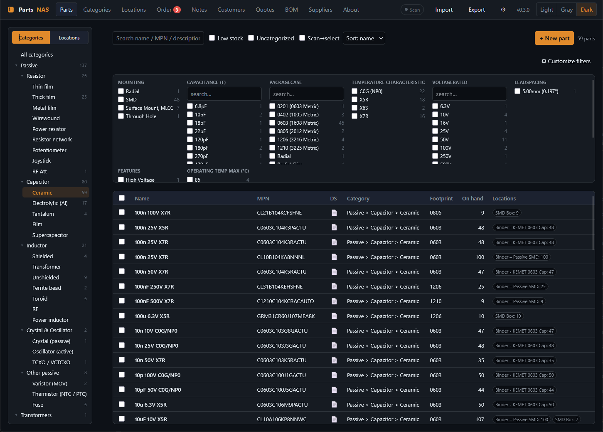
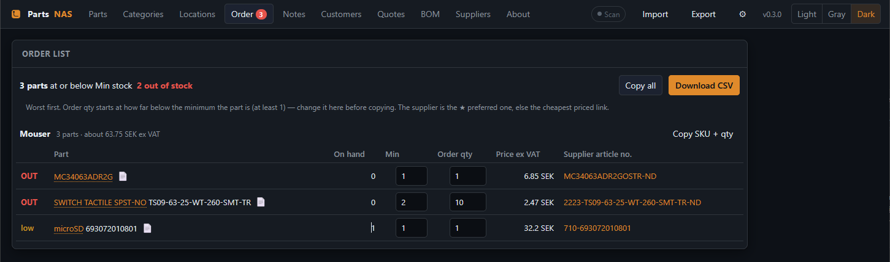
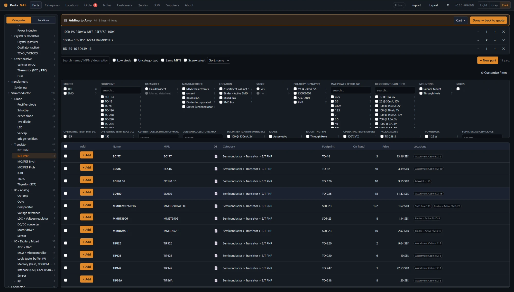
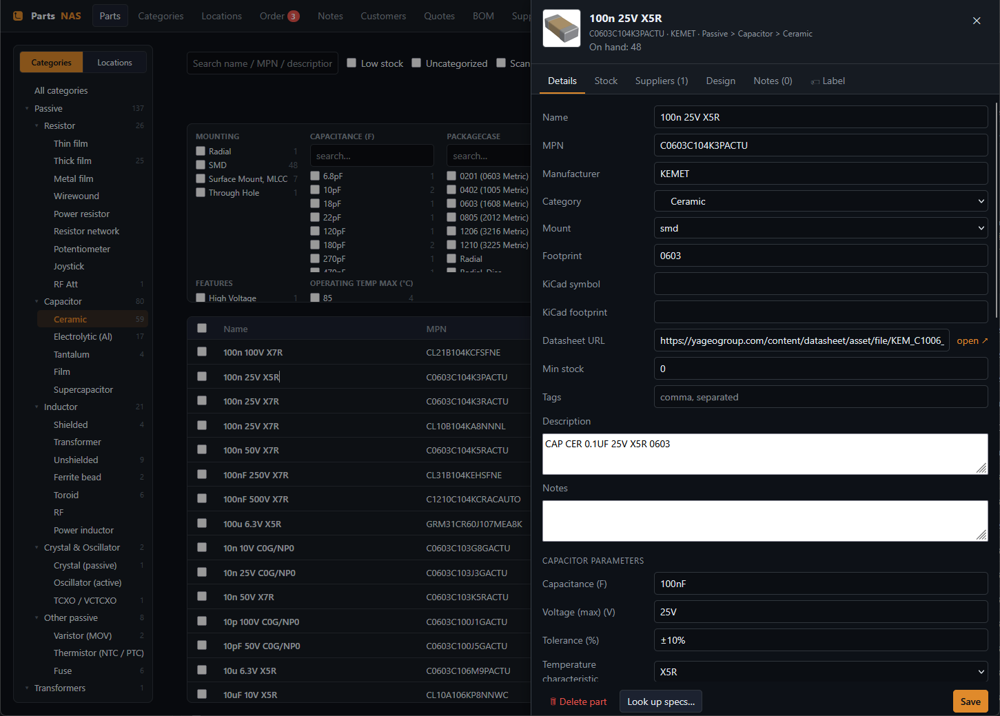

# PartsNAS

**Your parts bin, in a browser.** A private, self-hosted database for electronic and
mechanical components — what you have, where it is, what it costs, and what you
need to order next. It runs in Docker on a Synology NAS (built and tested on a
DS224+) or any other machine, and you use it from any browser on your home network.
No cloud, no account, no subscription: the data is one SQLite file on your own disk.



Built by a hobbyist for a home lab that also does the odd repair job for other
people, so it goes a bit further than an inventory: it can price a job, invoice it,
and tell you when a resistor drawer is running low. Inspired by
[PartsBox](https://partsbox.com/) and the old open-source
[ecDB](https://github.com/jwr/ecDB).

Version **0.5.0** · Python / FastAPI / SQLite · vanilla JS, no build step · [MIT license](LICENSE)

> **Please read this first.** PartsNAS is a **hobby project**, shared as it is, free of charge and with
> **no warranty of any kind**. It is **not** business, accounting or invoicing software. Use it at your
> own risk: **you alone are responsible** for how you use it and for anything that follows from it —
> including lost or wrong data, wrong prices, stock counts or totals, and anything you print, send or
> file based on it. The author takes **no responsibility or liability** for that. See
> [Disclaimer](#disclaimer) and the [LICENSE](LICENSE).

---

## What it does

**Keep track of everything you own**
- A category tree and a storage-location tree, both any depth. Create sub-levels
  inline, rename and delete; parts move up a level when you delete a branch.
- Stock is a ledger, not a number you overwrite: add, remove, count and move, one
  part in several places at once, and every change stays in the part's history.
- Fast filtering: search plus faceted filters (mount, footprint, manufacturer,
  location, capacitance, voltage, … whatever your parts actually have), with counts.
  You can also filter for parts that are **missing a footprint or a datasheet**, so
  the gaps in your data are easy to find.
- One click on the datasheet icon opens the datasheet in a new tab.
- Parts that share a manufacturer part number are pointed out (never merged or deleted): a chip
  in the list, a **Same MPN** filter, a banner on the part, and a warning in **+ New part** if the
  part you are typing already exists somewhere. Case and punctuation are ignored.
- A through-hole resistor shows its **colour bands**, drawn from the value and tolerance.
- Pictures, notes, tags, replacement/discontinued links, and design notes such as
  "with this regulator use these resistors for 5 V".
- Barcode and QR labels you can print (also for label printers such as a DYMO), and
  USB barcode scanners work anywhere in the app.
- Bulk edit: select everything that matches a filter and move it, tag it or set its
  minimum stock in one go, with an Undo button.

**Never run out of the small stuff**
- Give a part a *Min stock*. When it reaches it, it lands on the **Order** tab, worst
  first, grouped by supplier, with a red counter on the tab itself.
- Set the quantity, then **Copy SKU + qty** for a supplier's quick-order page, or
  download a CSV. The quantity you type is remembered for that part, so a resistor you always buy
  in tens stays at 50 instead of resetting to "one short".
- When you have placed the order, press **Ordered** (or **Mark all ordered…** for a whole supplier).
  The parts move to **On order** and are not ordered twice. When the package arrives, **Received…**
  asks for the quantity, the box it goes into and the price you paid, adds the stock, and can make
  that price the part's supplier price — so a later quote uses what you really paid.



**Price a job, invoice it**
- Build a quote like a web shop: open **Browse parts**, click parts into the cart and
  press *Done*. Filters, search and datasheet links all work while you shop.
- Cost is a snapshot from the part's supplier price; a markup (default 50 %, changeable
  per quote and per line) gives the selling price. Add labour, shipping and other lines.
- Quotes become invoices with a running number and an invoice date. **Lock** an invoice
  to freeze it, find it later in the **Archive**, and deleted ones go to a **Trash**
  first instead of vanishing.
- Prints cleanly with your logo, a page footer (name, address, payment details) and an
  optional **Swish QR code** with the total and invoice number filled in. Export to
  CSV or Excel. VAT can be shown, or folded into one price if you are not VAT-registered.
- A part that has no price yet is flagged before you invoice it, and clicking its
  article number opens the part so you can fetch a price and continue.



**Fill it without typing**
- **Look up specs** from Mouser and Digi-Key (bring your own API keys): parameters,
  datasheet, picture and prices. Only when you press the button — never in bulk — and
  rate-limited, pausing itself if a supplier ever blocks you.
- Import from a PartsBox export, a Mouser order history (`.xls`), a vendor kit list,
  or a **BOM exported from KiCad** (with matching against your stock).

**Yours to keep**
- Light, Gray and Dark themes, and a layout that works on a phone or tablet (categories and
  filters sit behind a **Filters** button there, so the list gets the screen).
- **Snapshot backup**: one ZIP that is an exact copy of everything — database, images,
  logo, settings — and a restore that puts it all back.
- **Automatic backup** (Settings, off by default): a snapshot every day into a folder you choose,
  keeping the newest few, with the last result or error shown in Settings.



---

## Getting started

### Option 1 — Synology NAS (Container Manager)

Needs DSM 7.2 or newer with **Container Manager** installed.

1. Download this repository (green **Code** button → *Download ZIP*, or `git clone`).
2. In **File Station**, copy the whole folder to your NAS, for example
   `/docker/partsnas`. It must contain `docker-compose.yml`, `Dockerfile`, `backend/`,
   `frontend/` and `seed/`.
3. Open **Container Manager → Project → Create**. Give it a name (`partsnas`), pick
   that folder as the path, and choose to use the existing `docker-compose.yml`.
4. Continue and let it build. The first build takes a few minutes.
5. Open `http://<your-nas-ip>:8770` in a browser.

Your data lives in the `data/` folder next to the compose file, so it survives
restarts and updates.

### Option 2 — Any machine with Docker

```bash
git clone https://github.com/Melkutt/PartsNAS.git
cd PartsNAS
docker compose up -d
```

Then open <http://localhost:8770>. Stop it with `docker compose down`; your data stays
in `./data`.

### Option 3 — Run it directly with Python (development)

Needs Python 3.11 or newer.

```bash
python -m venv .venv
.venv/Scripts/pip install -r backend/requirements.txt    # Windows
# .venv/bin/pip install -r backend/requirements.txt       # Linux / macOS

cd backend
../.venv/Scripts/uvicorn app.main:app --reload --port 8000   # Windows
# ../.venv/bin/uvicorn app.main:app --reload --port 8000      # Linux / macOS
```

Open <http://localhost:8000>. The database is created in `./data` the first time.

---

## Your first ten minutes

1. **Look around.** The category tree is already filled in (passives, semiconductors,
   connectors, mechanical, …). It also comes with a few example storage locations;
   rename or delete them under **Locations** and add your own boxes and drawers.
2. **Settings (the gear).** Choose your default currency and VAT rate, upload a logo,
   and write the name, address and payment details that should appear at the bottom of
   your invoices. If you use Swish, enter your number to get the QR code. Paste your
   Mouser and/or Digi-Key API keys if you want spec and price lookups.
3. **Add your first parts.** Press **+ New part**, or **Import** a spreadsheet you
   already have. Open a part and use *Look up specs…* to fill in the details.
4. **Say how much you have.** On a part's *Stock* tab, add a quantity to a location.
   Set a *Min stock* on the parts you never want to run out of.
5. **Try a quote.** On the **Quotes** tab, create one, press **Browse parts** and click
   a few parts in.

### Running the tests

```bash
cd backend
../.venv/Scripts/pip install -r requirements-dev.txt
../.venv/Scripts/python -m pytest                    # backend, against a throw-away database

cd ..
deno test --allow-read --allow-run tests/js          # frontend (Deno: https://deno.com)
```

The backend tests never touch your `data/` folder. The frontend tests check the supplier-attribute
mapping against 399 real Mouser and Digi-Key attribute names, the resistor colour code, and that every
module still parses.

## Configuration

Set these as environment variables (in `docker-compose.yml` under `environment:`).

| Variable | Default | What it does |
| --- | --- | --- |
| `PARTSNAS_DEFAULT_CURRENCY` | `SEK` | Starting currency; can also be changed in Settings. |
| `PARTSNAS_DEFAULT_VAT_PERCENT` | `25` | Starting VAT rate; can also be changed in Settings. |
| `PARTSNAS_DATA_DIR` | `./data` (`/data` in Docker) | Where the database and images are kept. |

## Backups and updating

- **Back up:** *Export → Snapshot — ZIP* gives you one file with everything. Keep a copy
  somewhere other than the NAS. (It contains your supplier API keys, so keep it private.)
- **Restore:** *Import → Restore a snapshot instead…* replaces everything with the
  snapshot. A safety copy of what was there is saved on the server first.
- **Automatic backup:** *Settings → Automatic backup* saves a snapshot every day at the hour you
  choose and keeps the newest few (default folder: `data/backups/auto`, next to your data). To save
  in another NAS folder, map it as a volume in `docker-compose.yml` (there is a commented example)
  and enter its container path. The last result, or the error, is shown in Settings.
- **Portable backup:** the other export in the same dialog is a data export you can merge
  into another database.
- **Update:** take a snapshot, replace the code on the server with the new version, and
  rebuild the project (*Container Manager → Project → Build*, or
  `docker compose up -d --build`). The `data/` folder is left alone. On Synology, starting an
  existing project again re-uses the old image, so remove the container and image first if the
  new code does not show up. The version and a **build id** in the top bar (a fingerprint of the
  code that is running) tell you which code the server really runs;
  `scripts/deploy_nas.ps1` copies the files, checks each one, and compares that id.

## Good to know

- **There is no login.** PartsNAS is meant for a trusted home network. Do not expose its
  port to the internet; if you need to reach it from outside, use a VPN. Anyone who can
  open the page can read and change everything.
- The Swish QR code only handles SEK. Currency and VAT are configurable, but the wording
  and a few defaults lean Swedish.
- KiCad integration today means importing a BOM from KiCad's schematic editor. A KiCad
  HTTP Library is planned, not built.

## Under the hood

FastAPI, SQLAlchemy 2.0 and SQLite (WAL) on the backend; plain HTML, CSS and ES modules
on the frontend, so there is nothing to build. One container serves both.

```
backend/app/     FastAPI app, models, importers, supplier lookups
backend/tests/   pytest
frontend/        the browser app (index.html, css/, js/)
tests/js/        Deno tests for the frontend logic
seed/            starter categories, footprint aliases, part-class fields
scripts/         seed generator, deploy_nas.ps1
docs/            screenshots
```

See [CLAUDE.md](CLAUDE.md) for the design notes, data model and roadmap. To start from
scratch, delete the `data/` folder while the app is stopped.

## Disclaimer

PartsNAS is a private hobby project that the author uses at home and has chosen to share. It is
provided **"as is"**, without warranty of any kind, and **you use it entirely at your own risk**.

- **Not a business tool.** The quotes, invoices, VAT handling, Swish QR code and totals are conveniences
  for a hobbyist. They are **not** a bookkeeping, tax or invoicing system and are not checked against
  any accounting, tax or invoicing rules. If you issue invoices or rely on the numbers, you are
  responsible for making sure they are correct and lawful where you live.
- **Your data is your responsibility.** Software has bugs, disks fail and updates go wrong. Make
  backups (see above), keep them somewhere else, and test that you can restore them. The author is not
  liable for lost, damaged or wrong data.
- **Supplier data can be wrong.** Specifications, prices, stock levels and part numbers fetched from
  Mouser, Digi-Key or anywhere else come from third parties and may be incorrect or out of date.
  Check them before you rely on them, especially before you buy, order or build something.
- **No security promises.** There is no login. Keep it on a trusted network and never expose it to the
  internet. API keys are stored in the database and in snapshots — keep those private.
- **Third-party services.** You need your own accounts and API keys, and you must follow those
  services' terms. PartsNAS is not affiliated with or endorsed by Mouser, Digi-Key, PartsBox, KiCad,
  Synology or anyone else mentioned here; the names belong to their owners.

To the fullest extent the law allows, the author is not responsible or liable for any claim, damage,
loss or other consequence arising from the use of, or inability to use, this software.

## License

[MIT](LICENSE) © 2026 Melkutt. In short: you may use, copy, change and share it freely, but it comes
with no warranty and no liability, as set out in the license text.
