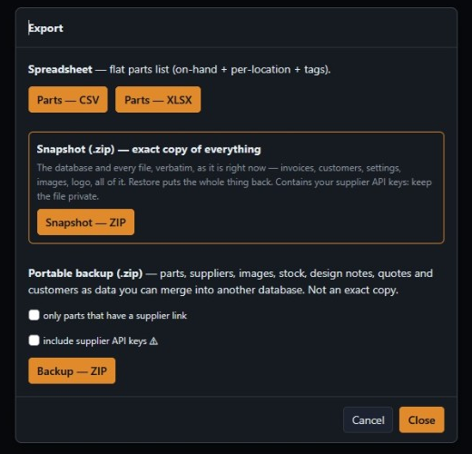

# Backup, restore and updating

PartsNAS keeps everything in one SQLite database plus a few folders of files (images, logo). There is no cloud
copy, so **your backups are the only safety net**. Take one before every update and keep a copy somewhere other than
the NAS.

## Export

*Export* in the top bar offers three different things:

| | What it is | Use it for |
|---|---|---|
| **Spreadsheet** (CSV / XLSX) | A flat parts list: on hand, per location, tags | Looking at your stock in Excel; not a backup |
| **Snapshot (.zip)** | An **exact copy of everything**: database, every file, invoices, customers, settings, images, logo | Backup and restore. This is the one to keep. |
| **Portable backup (.zip)** | Parts, suppliers, images, stock, design notes, quotes and customers as *data*, not an exact copy | Merging into another PartsNAS database. Can be limited to parts that have a supplier link, and can include your API keys. |

A snapshot contains your **supplier API keys** (they live in the database). Treat the file as private.

## Restore a snapshot

*Import → Restore a snapshot instead…* puts an earlier snapshot back.

1. Pick the `.zip`, and type `REPLACE` to confirm (a second guard against a stray click).
2. The server checks every file's checksum **before** it touches anything. A damaged snapshot is refused and nothing
   changes.
3. Whatever is there now is saved as a safety snapshot (`data/backups/pre-restore-<date>.zip`) and then replaced
   with the snapshot, and the page reloads.

**A snapshot from a newer PartsNAS** than the one running is not restored silently. You get a warning with both
version numbers and have to confirm, because this build may not understand everything in it. Nothing has been
changed at that point. Cancel, update PartsNAS first, and restore then.

## Import from other places

*Import* also reads a **PartsBox export**, a **Mouser order history** (`.xls`), a **vendor kit list** and a
**portable backup**. A portable backup has a mode:

| Mode | What it does |
|---|---|
| merge | only adds parts that are missing |
| update | also overwrites parts that already exist |
| replace | overwrites, and wipes attributes, suppliers and images of the parts it matches first |

Parts are matched by id first, then by MPN. **Dry run** shows what would happen and writes nothing: use it first.

## Automatic backup

*Settings → Automatic backup* (off by default) saves a snapshot every day at the hour you choose and keeps the newest
few. The default folder is `data/backups/auto`, next to your data. To save in another NAS folder, map it as a volume
in `docker-compose.yml` (there is a commented example) and enter its container path. The last result, or the error,
is shown in Settings.

Remember that a backup in the same folder as the data does not survive that disk failing. Copy one off the NAS now
and then, and try a restore once so you know it works.

## Is there a newer version?

*About* shows the version and the **build id**, a fingerprint of the code that is running, next to a link to the
repository. **Check for updates** compares them with the `version.json` published in the GitHub repository and says
one of:

- a newer version is available (with the release notes),
- you run the latest version,
- same version but a different build (the code differs from the published one),
- you are ahead of the published version.

While the repository is private, GitHub does not hand the file out without a login. Under *Settings → Updates* you
can give a **read-only GitHub token** (a fine-grained token for this repository with *Contents: read-only*; it is
only ever sent to GitHub) or another address that serves the file. When the repository is public it works by itself.

## Updating

1. Take a **snapshot** (above) and copy it off the NAS.
2. Replace the code on the server with the new version. The `data/` folder is left alone.
3. Rebuild the project: *Container Manager → Project → Build*, or `docker compose up -d --build`.
4. On Synology, starting an existing project again re-uses the old image. If the new code does not show up, remove
   the container **and** the image, then create it again.
5. Check *About* (or the top bar): the version and build id say which code the server really runs.

`scripts/deploy_nas.ps1` automates steps 2 and 5 from a Windows machine: it copies the files, verifies each one by
hash, and compares the build id of the running app with the code it copied.
